# 🧠 Aithink App – AI Powered Chat Application

Aithink is a clean, responsive, and secure AI-powered chat application designed with a smooth user experience.  
It includes a complete authentication system with onboarding, email verification, OTP flow, and a modern chat interface.

---

## 🚀 Features

- Beautiful and minimal UI  
- Secure authentication (Login, Register, Forgot Password)  
- Email verification + OTP flow  
- Reset password system  
- Clean home & chat UI  
- Responsive layouts  
- Smooth and intuitive navigation  

---

### ⭐ Intro & Authentication Flow

| Intro Page | Login Page | Register Page |
|-----------|------------|----------------|
| 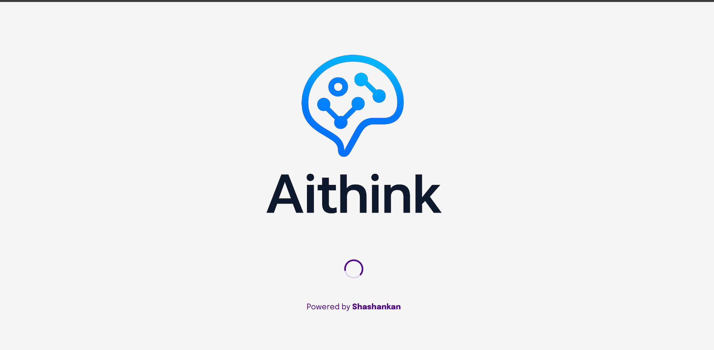 |  | 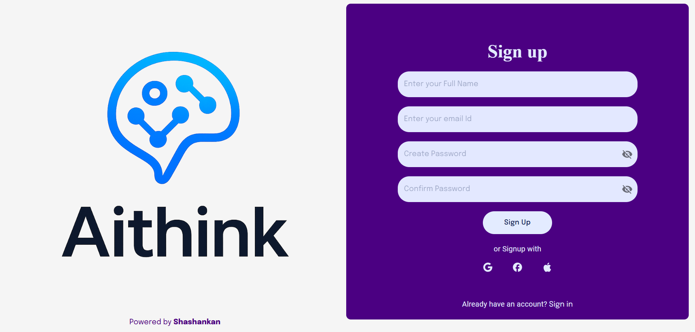 |

---

### ⭐ Verification Screens

| Email Verify | OTP Input | Change Password |
|-------------|-----------|------------------|
| 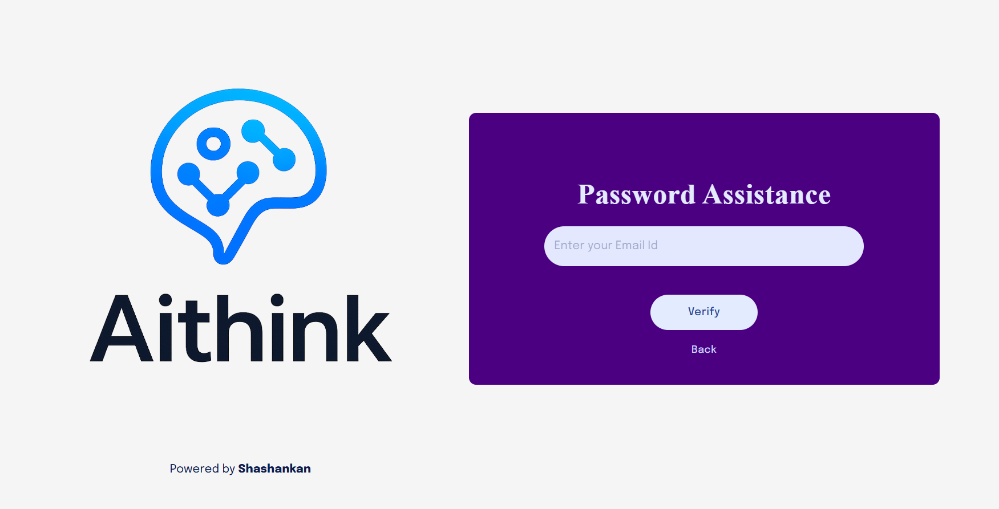 | 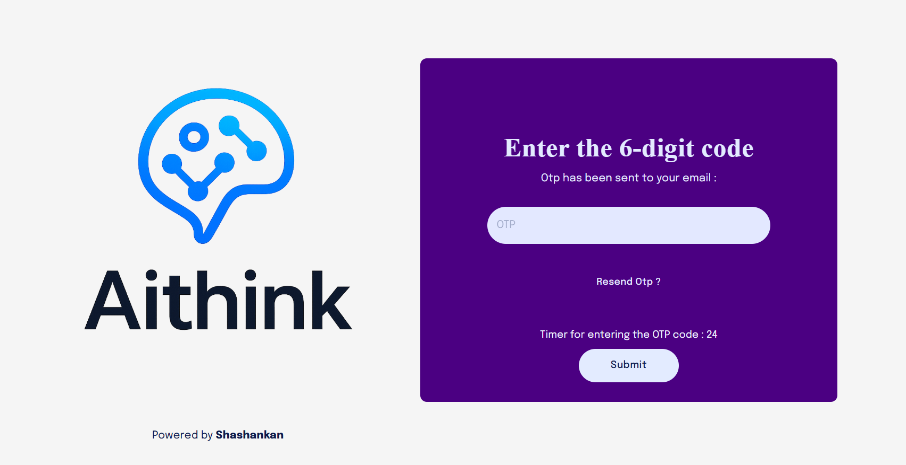 | 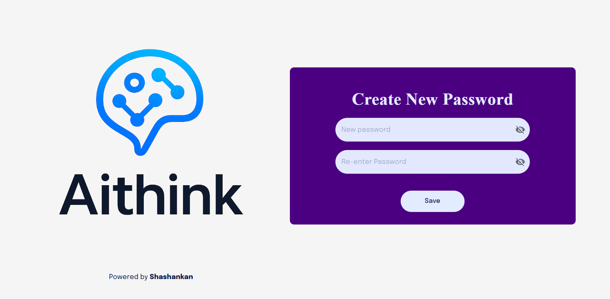 |

---

### ⭐ Home / Chat UI

| Home Page | Chat List | Chat Window |
|-----------|-----------|--------------|
|  | 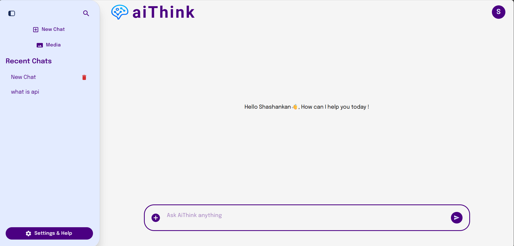 | 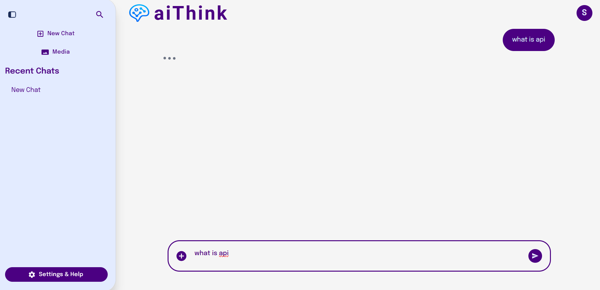 |

---

### ⭐ Additional Images

| Image 1 | Image 2 | Image 3 | 
|-----------|-----------|-----------|-----------|
| 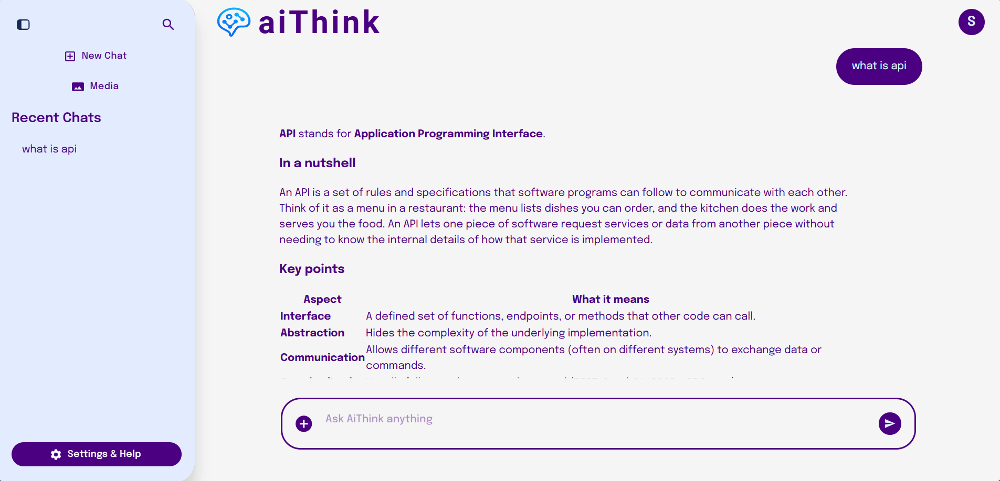 | 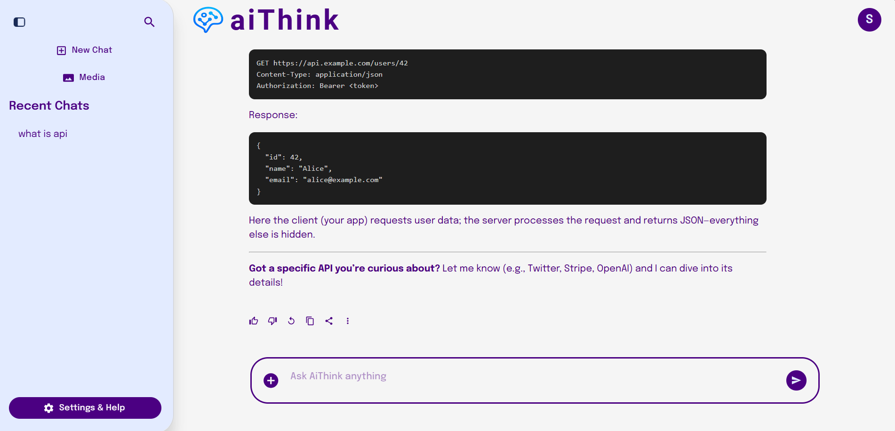 | 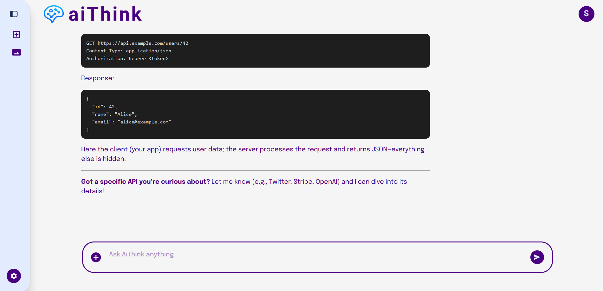 |

| Image 4 | Image 5 |
|-----------|-----------|
| 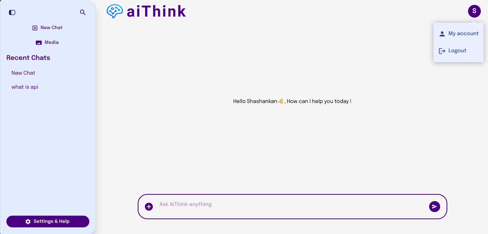 | 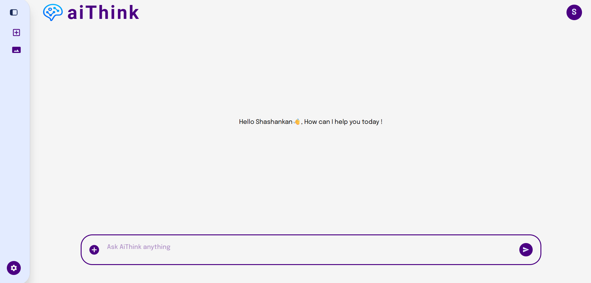  | 

---

## 🛠 Tech Stack

- **Frontend:** React.js  
- **Backend:** Node.js , Express   
- **UI Library:** Material UI  
- **Authentication:** JWT, Email OTP  
- **Database:** Mongo Db

---

## 📦 Installation

```bash
git clone https://github.com/your-username/Aithink-app.git
cd Aithink-app
cd client
npm install
npm run dev
cd server
npm install
npm run start
